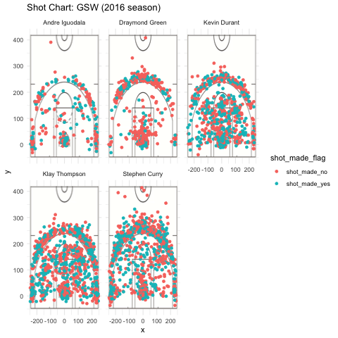

```{r setup, include=FALSE}
knitr::opts_chunk$set(echo = TRUE)
```

```{r, include=FALSE}
library(grid)
library(jpeg)
library(ggplot2)
library(dplyr)

shots_data <- read.csv("../data/shots-data.csv", stringsAsFactors = FALSE)

ai <- shots_data[shots_data$name == "Andre Iguodala", ]
dg <- shots_data[shots_data$name == "Draymond Green", ]
kd <- shots_data[shots_data$name == "Kevin Durant", ]
kt <- shots_data[shots_data$name == "Klay Thompson", ]
sc <- shots_data[shots_data$name == "Stephen Curry", ]


get_row <- function(dat, n) {
  yes <- sum(dat$shot_made_flag == "shot_made_yes")
  total <- sum(dat$shot_made_flag == "shot_made_yes") + sum(dat$shot_made_flag == "shot_made_no")
  perc_made <- yes/total
  return(c(n, yes, total, perc_made))
  }
```

### GSW Shooting Statistics
####Intro
In the 2016 season, 5 players on the Golden State Warriors made a cumulative 4334 shot attempts. Their success rate was around 50%, and delving deeper into these statstics can reveal the variation in their different skills, and how they balance each other out as teammates. The purpose of this report is to gain some insights into the shooting statistics of these five players from the Golden State Warriors: Andre Iguodala, Draymond Green, Kevin Durant, Klay Thompson, and Stephen Curry. 
Using data about shots made and attempted during the 2016 season, we can learn things about which players are most successful with their shots and about what types of shooting work for each player. 

###Shot Statistics
The following table provides some information about different players success rates when making shots:
```{r, echo=FALSE}
library(knitr)
allpt_table <- c(get_row(ai, "Andre Iguodala"),
                 get_row(dg, "Draymond Green"),
                 get_row(kd, "Kevin Durant"),
                 get_row(kt, "Klay Thompson"),
                 get_row(sc, "Stephen Curry"))

allpt_table <- matrix(allpt_table, ncol = 4, nrow = 5, byrow = TRUE)
colnames(allpt_table) <- c("name", "total", "made", "perc_made")

allpt_table <- data.frame(allpt_table)
kable(arrange(allpt_table, perc_made, desc(perc_made)))
```

From this table, we can see that of these 5 players, Kevin Durant and Andre IGuodala were the only ones to make at least half of the shots they took. Another interesting statistic is the fact that Stephen Curry and Klay Thompson made around 1200 shots each, which is much higher than the rest of the players. This is likely due to their position. 

Breaking down the shot chart by type of shot, we can see that the number of 2 point shots made by each player is as follows:

```{r, echo=FALSE}
library(knitr)
twopt_table <- c(get_row(ai[ai$shot_type == "2PT Field Goal", ], "Andre Iguodala"),
                 get_row(dg[dg$shot_type == "2PT Field Goal", ], "Draymond Green"),
                 get_row(kd[kd$shot_type == "2PT Field Goal", ], "Kevin Durant"),
                 get_row(kt[kt$shot_type == "2PT Field Goal", ], "Klay Thompson"),
                 get_row(sc[sc$shot_type == "2PT Field Goal", ], "Stephen Curry"))

twopt_table <- matrix(twopt_table, ncol = 4, nrow = 5, byrow = TRUE)
colnames(twopt_table) <- c("name", "total", "made", "perc_made")

twopt_table <- data.frame(twopt_table)
kable(arrange(twopt_table, perc_made, desc(perc_made)))
```

Again, Andre Iguodala and Kevin Durant have the highest percentage rates of making these shots. 
We can also examine the number of 3 point shots made by each player:
```{r, echo=FALSE}
library(knitr)
threept_table <- c(get_row(ai[ai$shot_type == "3PT Field Goal", ], "Andre Iguodala"),
                 get_row(dg[dg$shot_type == "3PT Field Goal", ], "Draymond Green"),
                 get_row(kd[kd$shot_type == "3PT Field Goal", ], "Kevin Durant"),
                 get_row(kt[kt$shot_type == "3PT Field Goal", ], "Klay Thompson"),
                 get_row(sc[sc$shot_type == "3PT Field Goal", ], "Stephen Curry"))

threept_table <- matrix(threept_table, ncol = 4, nrow = 5, byrow = TRUE)
colnames(threept_table) <- c("name", "total", "made", "perc_made")

threept_table <- data.frame(threept_table)
kable(arrange(threept_table, perc_made, desc(perc_made)))
```

From this graph, we see that Stephen Curry and Klay Thomspon have the highest percentage rates of success when shooting 3 point shots. These two charts also show the types of shots preferred by different players - Curry seems to attempt about as many 3 point shots as he does 2 point shots, while Durant attemped about twice as many 2 point shots as 3 point shots. 

###Shot Locations
The following graphic provides some insight into the locations on the court from which the different players made their shots.

```{r out.width='80%', echo = FALSE, fig.align='center'}

```

This set of graphs shows us visually that Kevin Durant and Klay Thompson tend to make shots from all over the court. The density of the red and green show how the proportion of shots made. Iguodala and Green have a lower number of overall shot attempts, which proobably has to do with the positions they play as well. Iguodala has the highest shot success rate however, so the shots he does make are likely to be successful. 

###Conclusions
Some conclusions we can draw from this data are that Stephen Curry and Klay Thompson are especially valuable to the Golden State Warriors for their skills in shooting 3 point shots, while Andre Iguodala and Kevin Durant are valuable for their more well rounded skills in shooting both 2 point and 3 point shots. 
